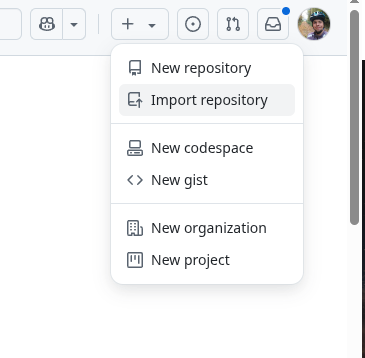

# Homework for git pull request classes 

## Requirements 

Your task is to create a copy of this repository (copy, not fork).

Clone the repository, checkout `adding_tests` branch, 
fix the tests in `tests/test_example.py` file. Push changes to your remote repository.

Then, create a merge request (or pull request if you use GitHub) from `adding_tests` branch to `main` branch.

Resolve any conflicts that may arise. 

Finally, add a comment to the merge request with a link to your repository and merge changes.

## Making Copy of this repository

### Gitlab

1. Select "New project/repository" from 
  
   
2. Select "Import project" from

   
3. Select Repository by URL and provide `https://gitlab.mimuw.edu.pl/python-tools/git-pull-request-exercise` as URL.
   
   
 
### GitHub

1. Select "Import repository" from 

   
2. Provide `https://gitlab.mimuw.edu.pl/python-tools/git-pull-request-exercise` as URL and select "Begin import".
   
   